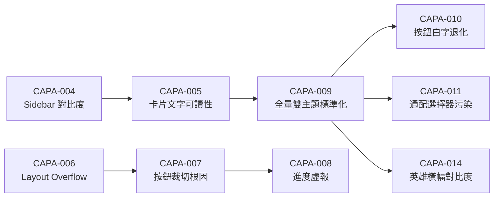

# 將 CAPA 報告體系轉化為專案自進化有機體 — 實施計畫

> **文件編號**：IMPL-PLAN-002  
> **建立日期**：2026-08-24  
> **建立者**：Antigravity (AI Senior Architect & Top Digital Art Director)  
> **狀態**：📋 待實施 (Ready for Implementation)  
> **關聯 Commit 基準**：`95f6126`（CAPA-001~014 全覆蓋）

---

## 1. 目標願景

> 讓 14 份 CAPA 報告不再是靜態文件，而是成為驅動專案持續優化的活養分。
> 使專案成為一個「能從自身錯誤中學習」的持續優化有機體。

---

## 2. 現況診斷

### 2.1 現有自進化生態系統

| 層級 | 工具 | 職責 | 觸發時機 |
| :--- | :--- | :--- | :--- |
| 萃取 | `kb-indexer.mjs` | 從 CAPA 報告萃取 tags/fix_code 至 `issues.yaml` | pre-commit |
| 主動預警 | `kb-proactive-check.mjs` | 比對 staged 代碼與已知問題模式，提前警告 | pre-commit / pre-push |
| 效果統計 | `kb-analytics.mjs` | 統計預警復用率、準確率、產出週報 | 手動 / daily-scan |
| 門禁閉環 | `auto-evolution-gate.mjs` | 協調 KB索引 → MECE → 對比度防禦全自動流水線 | pre-commit |
| 失敗模式偵測 | `fail-pattern-detector.mjs` | 分析近 7 天失敗記錄，偵測重複模式 | pre-push |
| 對比度防禦 | `contrast-check.mjs` | 全色系深色容器/按鈕白字自動掃描 | pre-commit |
| MECE 校驗 | `mec-validator.mjs` | 確保 CAPA 報告結構完整度 100/100 | pre-commit / pre-push |
| DoD 門禁 | `do-d-check.mjs` | 5 項交付完成定義驗證 | pre-push |
| 版號同步 | `sync-version.mjs` / `verify-version-consistency.mjs` | 單一真相來源版號管理 | pre-commit / pre-push |

### 2.2 現有痛點

1. **KB 知識庫品質低**：`issues.yaml` 中的 `title` 全部為 `"1. 問題描述"`（第一個 H2 的文字），無法反映問題的真正本質；`fix_code` 是未結構化的大段文字牆，缺乏精準的「反模式 → 正確模式」映射。
2. **CAPA 間缺乏交叉引用**：14 份報告各自獨立，缺少因果鏈與演化脈絡（例如：CAPA-009 的教訓是否真正被 CAPA-014 吸收？）。
3. **缺少全局進化儀表板**：沒有一份文件能讓人一眼看出「專案從 CAPA-001 到 CAPA-014 學到了什麼、還有什麼風險未解」。
4. **預警命中率不透明**：`kb-proactive-check` 的匹配邏輯仰賴 tag 相似度，但 tag 品質粗糙（如 `mece`、`css` 過於泛化），導致預警噪聲高、精準度低。

---

## 3. 實施方案（4 大組件）

### 3.1 升級 KB Indexer 萃取品質 — 結構化反模式知識庫

**修改檔案**：`.impeccable/scripts/kb-indexer.mjs`

**改動重點**：
- **Title 智慧萃取**：從 CAPA 報告中優先匹配 `# CAPA-NNN 報告：XXX` 的冒號後半部作為 `title`，而非固定取第一個 H2。
- **Anti-Pattern → Correct-Pattern 結構化**：從 MECE 六大維度的 `- [✗]` 條目萃取 `anti_patterns[]`，從 `- [✓]` 條目萃取 `correct_patterns[]`，取代現有的 `fix_code` 大文字牆。
- **因果鏈標記**：偵測報告內對其他 CAPA 編號的引用（如 `CAPA-006`、`CAPA-010`），自動建立 `related_capas[]` 交叉引用欄位。

**預期 issues.yaml 結構升級**：
```yaml
entries:
  - id: CAPA-014
    title: "淺色模式下英雄橫幅與膠囊標籤文字對比度退化"  # ← 從報告標題智慧萃取
    category: CSS
    tags: [contrast, hero-banner, light-mode, gradient]
    severity: high
    anti_patterns:                                         # ← 新欄位：反模式清單
      - "bg-gradient-to-r from-sky-900（未加 dark: 前綴）"
      - "html:not(.dark) h2.text-white { color: #0f172a !important; }"
    correct_patterns:                                      # ← 新欄位：正確模式清單
      - "bg-white dark:bg-slate-900/90 border border-slate-200"
      - "text-slate-900 dark:text-white（雙主題標準）"
    related_capas: [CAPA-009, CAPA-010, CAPA-011]          # ← 新欄位：因果鏈
    status: active
```

---

### 3.2 新增 CAPA 進化儀表板 — 全局進化總覽

**新增檔案**：
- `docs/CAPA-Evolution-Dashboard.md` — 自動生成的進化總覽文件
- `.impeccable/scripts/capa-dashboard-generator.mjs` — 生成腳本

**儀表板內容**：
1. **CAPA 全覽索引表**：編號、日期、問題摘要、嚴重度、狀態、因果鏈關聯
2. **進化脈絡圖（Mermaid）**：以因果鏈連接相關 CAPA，形成可視化的問題演化樹
3. **類別統計**：按 CSS/流程/DevOps/安全等維度統計問題分佈
4. **開放風險一覽**：列出所有狀態為「觀察中」或「開放」的 CAPA（如 CAPA-003 xlsx 漏洞）
5. **進化成熟度記分卡**：量化專案的自進化能力

**Mermaid 因果鏈圖範例**：


---

### 3.3 升級主動預警匹配精度

**修改檔案**：`.impeccable/scripts/kb-proactive-check.mjs`

**改動重點**：
- **反模式程式碼比對**：利用新結構化的 `anti_patterns[]`，對 staged 代碼做精確子字串匹配（如偵測到 `from-sky-900` 且無 `dark:` 前綴 → 直接命中 CAPA-014 反模式），取代現有粗糙 tag 匹配。
- **分級預警**：
  - `CRITICAL`：直接命中反模式代碼片段
  - `WARNING`：tag 相似度命中
  - `INFO`：因果鏈相關 CAPA 提示

---

### 3.4 整合進 Git Hooks 自動生態

**修改檔案**：`.husky/pre-push`

在 MECE 校驗之後加入 `capa-dashboard-generator.mjs` 自動更新步驟，確保每次推送時進化儀表板與知識庫 100% 同步。

---

## 4. 待決事項 (Open Questions)

> ⚠️ 以下事項需接手開發者決策：

1. **定期覆核機制**：目前 14 份 CAPA 中，CAPA-003（xlsx 漏洞）的狀態為「觀察中」，其餘均已關閉。是否需要在儀表板中設立「定期覆核」機制（例如每月自動提醒檢查 xlsx 是否有新版本）？
2. **輸出格式**：是否希望 CAPA 進化儀表板也以 HTML 格式產出（可嵌入到網頁應用中作為「系統健康度」頁面），還是 Markdown 格式即可？

---

## 5. 驗證計畫

### 自動化驗證
```bash
# 1. KB Indexer 品質驗證
node .impeccable/scripts/kb-indexer.mjs
# → 確認 title 不再是 "1. 問題描述"
# → 確認 anti_patterns / correct_patterns 欄位存在

# 2. CAPA Dashboard 生成驗證
node .impeccable/scripts/capa-dashboard-generator.mjs
# → 確認 docs/CAPA-Evolution-Dashboard.md 生成且包含 14 筆 CAPA

# 3. 全量 Pre-push 閉環驗證
git push origin master
# → 所有門禁通過，儀表板自動更新
```

### 人工驗證
- 目視確認 `CAPA-Evolution-Dashboard.md` 中的 Mermaid 因果鏈圖可正確渲染
- 確認 `issues.yaml` 中每個 entry 的 `title` 為有意義的問題摘要
- 故意寫入一段已知反模式代碼（如 `from-sky-900` 不帶 `dark:`），確認 `kb-proactive-check` 能精準預警

---

## 6. 實施優先順序建議

| 優先級 | 組件 | 預估工時 | 理由 |
| :--- | :--- | :--- | :--- |
| **P0** | 3.1 KB Indexer 萃取升級 | 2~3 小時 | 基礎設施，後續組件依賴此結構化數據 |
| **P1** | 3.2 CAPA 進化儀表板 | 1~2 小時 | 高可見度，立即產出價值 |
| **P2** | 3.3 主動預警精度升級 | 1~2 小時 | 依賴 P0 的反模式結構化數據 |
| **P3** | 3.4 Git Hooks 整合 | 0.5 小時 | 純機械性整合，最後收尾 |

---

## 7. 相關文件索引

| 文件 | 路徑 | 用途 |
| :--- | :--- | :--- |
| CAPA 報告集（001~014） | `docs/CAPA-*.md` | 14 份完整 CAPA 報告 |
| 知識庫 | `.impeccable/kb/issues.yaml` | 自動萃取的結構化知識 |
| 自進化門禁 | `.impeccable/scripts/auto-evolution-gate.mjs` | 全自動自進化閉環控制器 |
| KB 索引器 | `.impeccable/scripts/kb-indexer.mjs` | CAPA → KB 萃取引擎 |
| 主動預警 | `.impeccable/scripts/kb-proactive-check.mjs` | 開發時主動預警比對 |
| 效果統計 | `.impeccable/scripts/kb-analytics.mjs` | 預警復用率統計分析 |
| 對比度防禦 | `.impeccable/scripts/contrast-check.mjs` | 全色系雙主題對比度掃描 |
| MECE 校驗 | `.impeccable/scripts/mec-validator.mjs` | CAPA 報告結構完整度校驗 |
| DoD 門禁 | `.impeccable/scripts/do-d-check.mjs` | 5 項交付完成定義驗證 |
| Pre-commit Hook | `.husky/pre-commit` | 提交前自動化閘門 |
| Pre-push Hook | `.husky/pre-push` | 推送前完整品質閘門 |
| 開發日誌 | `DEV_LOG.md` | 歷史開發記錄與 CAPA 索引 |
