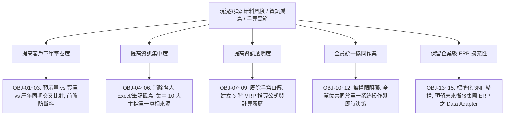

# 料事如神系統 (PMS) — 業務需求規格書 (BRD)
## Business Requirements Document & Functional Blueprint

> **文件編號**：`PMS-BRD-20260824`  
> **系統名稱**：料事如神系統 — Predictive Material System (PMS)  
> **版本**：`V1.2.0`（核心開發目標詳細拆解版）  
> **制定日期**：2026-08-24  
> **適用對象**：全體協同單位（業務部、製造部廠長/課長、資材生管採購）  
> **系統架構制定**：資深全端架構師 & 專案開發小組  

---

## 1. 專案背景與核心目標 (Background & Core Objectives)

### 1.1 專案背景
本公司專注於精密塑膠射出成型製造。以往各單位運作習慣以「個人經驗、口語溝通、紙本手寫計算」為主，導致客戶預示量與實際下單脫節、資訊散落各處、原料估算無可追溯依據，已發生多次可見的**斷料與交期危機**。

### 1.2 系統設計指導原則（全員協同模式）
> [!IMPORTANT]
> **全體單位統一操作原則**：  
> 現階段**不進行嚴格的部門權限切分或審批門檻設定**。系統預設為**全員開放協同平台（All-in-One Collaborative Workspace）**，廠長、課長、業務部、生管/採購（玉婷）等所有角色皆可在本系統上直接查閱、維護資料與執行推算，以最大化資訊流動效率，全力滿足業務單位的備料與排程需求。

---

## 2. 業務核心訴求拆解：15 項具體開發目標 (15 Specific Project Objectives)

本專案將業務單位的 5 大核心訴求，嚴格拆解為 **15 項具體、可量化、可驗收的開發目標 (OBJ-01 ~ OBJ-15)**，作為全系統開發、重構與功能驗收的主要核心指標：

---

### 【維度一：提高客戶下單掌握度，提升備料能力】

#### 🔹 目標 1 (OBJ-01)：建立客戶預示量 (Forecast)、實際訂單 (PO) 與歷年同期下單之三向交叉比對引擎
* **現況痛點**：以往未分析客戶預示量，亦未與實單及歷史數據比對，全憑個人經驗運作。
* **具體開發功能**：
  1. 建立「三向需求交叉比對矩陣視圖」，同屏直觀並列呈現：① 客戶滾動預示量（分版本）、② 正式確認訂單量（已下單 PO）、③ 歷年同期歷史下單基準。
  2. 支援按「客戶」、「產品料號 (SKU)」、「週別/月份」多維度切換檢視。
* **衡量指標 (DoD)**：系統能一鍵產出全品號之「預測 vs 實單 vs 歷史」三向折線圖與差異比對表，比對響應時間 $< 1$ 秒。

#### 🔹 目標 2 (OBJ-02)：實裝需求波動與預測偏差自動偵測示警機制 (Forecast Bias Alert)
* **現況痛點**：客戶訂單暴增或取消時無前瞻預警，導致產線措手不及或原物料斷料。
* **具體開發功能**：
  1. 演算法自動計算預測偏差率：$\text{Bias \%} = \frac{\text{Actual} - \text{Forecast}}{\text{Forecast}} \times 100\%$。
  2. 實裝三色動態警戒燈號：
     - 🟢 **正常（偏差 $\le \pm 10\%$）**：綠色安全標籤。
     - 🟡 **注意（偏差 $\pm 11\% \sim \pm 25\%$）**：黃色注意標籤，提示業務主動向客戶確認。
     - 🔴 **高危異常（偏差 $> \pm 25\%$ 或連續 2 期巨幅波動）**：紅色告警，自動標記為潛在斷料/呆滯高風險品項。
* **衡量指標 (DoD)**：任一品號發生異常偏差時，系統即時於戰情首頁與訂單列表頂部彈出警示清單。

#### 🔹 目標 3 (OBJ-03)：建立前瞻安全庫存防線與「最晚採購下單日 (Order Deadline)」推算邏輯
* **現況痛點**：未考慮供應商採購前置天數（Lead Time），常等到庫存歸零才緊急請購，造成停線。
* **具體開發功能**：
  1. 系統自動倒推公式：$\text{最晚下單日} = \text{需求上線日} - \text{供應商前置交期 (Lead Time)} - \text{入廠檢驗緩衝天數}$。
  2. 動態標記「即將逾期」與「已逾期未訂」物料，提供視覺化倒數計時。
* **衡量指標 (DoD)**：自動生成「未來 30 天每日應下單原料採購行事曆」，杜絕因交期不及導致的停機。

---

### 【維度二：提高資訊集中度，消除資訊孤島與增加效率】

#### 🔹 目標 4 (OBJ-04)：集中維護 10 大核心營運主檔，建立單一數據真相來源 (Single Source of Truth)
* **現況痛點**：資訊散落在廠長（產能）、課長（模具/良率）、業務部（預測/訂單）、玉婷（庫存/採購）各自手中。
* **具體開發功能**：
  1. 建立統一「數據中心 (Data Center)」，完整集中管理 10 大主檔：
     - ① 料號基本檔、② 模具產能檔、③ 產品模具 BOM、④ 良率標準檔、⑤ 供應商採購規則、⑥ 業務需求預測檔、⑦ 實際訂單檔、⑧ 庫存 WIP 快照、⑨ 在途採購 PO、⑩ Sorting 實際良率紀錄。
  2. 支援標準 Excel 範本一鍵批次匯入/匯出，具備格式驗證與自動防呆。
* **衡量指標 (DoD)**：消除各單位獨立維護的多頭 Excel，全廠 100% 業務與生產數據統一由本系統中央存取。

#### 🔹 目標 5 (OBJ-05)：開發「週二出貨可行性放行審查看板 (Ship Schedule Clearance)」
* **現況痛點**：每週二出貨協調會需耗費大量時間人工核對庫存、待驗品與訂單，容易誤判。
* **具體開發功能**：
  1. 一鍵推算雙週出貨覆蓋率：$\text{可放行量} = \text{成品在庫良品} + (\text{WIP 待驗品} \times \text{全檢良率}) - \text{未結確認訂單}$。
  2. 依據缺口等級自動給予決策建議：`100% 放行`、`需 WIP 優先檢驗支援`、`實質缺料赤字（不可出貨）`。
* **衡量指標 (DoD)**：出貨協調會議由以往耗時 1~2 小時縮短至 **5 分鐘內**藉由系統看板完成全品項放行審查。

#### 🔹 目標 6 (OBJ-06)：開發「訂單缺料分析與瓶頸診斷看板 (Order Tension Tracker)」
* **現況痛點**：無法直觀看出特定訂單卡在哪個環節，業務難以向客戶回覆確切交期。
* **具體開發功能**：
  1. 逐筆訂單診斷 6 大環節：① 預測覆蓋、② 模具可用性、③ 原料在庫、④ WIP 進度、⑤ 在途 PO ETA、⑥ 產能負荷。
  2. 輸出缺料緊張度評級與標準應變處置建議。
* **衡量指標 (DoD)**：業務點選任何一張訂單，系統立即顯示該訂單的物料備料狀況與瓶頸節點。

---

### 【維度三：提高資訊透明度，數位化估算依據與推導履歷】

#### 🔹 目標 7 (OBJ-07)：落實標準 3 階 MRP 原料需求推導演算法，廢除口語經驗與紙本手算
* **現況痛點**：備料量與時程依賴口語經驗與手寫筆記，無推導公式與驗算標準。
* **具體開發功能**：
  1. **第 1 階（成品淨需求）**：$\text{FG 淨需求} = \max(0,\ \text{需求量} - \text{良品在庫} - \text{WIP} \times \text{良率})$。
  2. **第 2 階（原料毛需求）**：$\text{原料毛需求} = \frac{\text{FG 淨需求} \times \text{BOM 用量}}{\text{成型良率} \times (1 - \text{損耗率})}$。
  3. **第 3 階（建議採購量）**：$\text{淨缺口} = \text{原料毛需求} + \text{安全庫存} - (\text{在庫} + \text{在途})$；$\text{建議量} = \text{Ceil}(\text{淨缺口}, \text{MOQ})$。
* **衡量指標 (DoD)**：全廠所有原料採購推算皆嚴格符合 3 階 MRP 標準公式，計算結果 100% 可被覆核驗證。

#### 🔹 目標 8 (OBJ-08)：實裝「計算公式明細卡片 (Explainable Calculation Card)」
* **現況痛點**：採購或主管看到建議數量時不知道「數字從何而來」，缺乏信任度。
* **具體開發功能**：
  1. 介面上任何一筆「建議採購量」或「原料毛需求」皆可點擊展開**公式明細解析**。
  2. 卡片內完整列出所有帶入的即時變數：包含基礎需求量、BOM 配比、成型損耗%、良率%、庫存扣抵、在途 PO 扣抵及 MOQ 向上整補過程。
* **衡量指標 (DoD)**：達到「點擊即看公式、變數完全透明、推導有跡可循」的目標。

#### 🔹 目標 9 (OBJ-09)：開發「What-If 情境模擬器 (Scenario Simulation Engine)」
* **現況痛點**：當客戶臨時追加訂單或供應商延遲交貨時，無法快速評估影響範圍。
* **具體開發功能**：
  1. 支援業務動態調整「假設追加需求量 $+X\%$」或「供應商交期延誤 $+Y$ 天」。
  2. 系統於 1 秒內即時重算並呈現「備料赤字變動」、「交期延誤風險」與「產能超載預警」。
* **衡量指標 (DoD)**：提供業務在客戶端商務談判時具備秒級的「插單/交期評估能力」。

---

### 【維度四：全體單位同台協同操作（無權限阻礙 · 業務賦能）】

#### 🔹 目標 10 (OBJ-10)：打造全員開放式無門檻協同平台 (Universal Collaborative Workspace)
* **現況痛點**：以往各單位各行其是，系統若設定複雜權限將造成初期推行困難。
* **具體開發功能**：
  1. 現階段不設繁瑣的審批角色權限，預設所有單位（業務、廠長、課長、玉婷）皆可在同一個現代化響應式介面上進行檢視、搜尋、維護與推算。
  2. 介面具備國際一級 UI/UX 質感，提供淺色/深色模式（Light/Dark Theme）與直覺式引導卡片。
* **衡量指標 (DoD)**：新進同仁無須複雜培訓即可於 10 分鐘內上手查詢物料狀態與產能排程。

#### 🔹 目標 11 (OBJ-11)：建立開會統一投影標準作業視圖 (Single Screen Collaboration)
* **現況痛點**：跨部門開會時各執一份 Excel，數字兜不攏導致會議冗長無結論。
* **具體開發功能**：
  1. 產銷協調會與出貨會議直接將 PMS 系統畫面投影至大螢幕。
  2. 開會當場共同查看「綜合戰情儀表板」與「出貨審查看板」，當場確認數字與決策。
* **衡量指標 (DoD)**：徹底終結跨部門開會時「拿不同 Excel 版本對帳」的無效內耗。

#### 🔹 目標 12 (OBJ-12)：實裝自動化變更審計軌跡 (Audit Log & History Traceability)
* **現況痛點**：資料被修改後不知由誰何時更動，造成資訊混亂。
* **具體開發功能**：
  1. 系統自動在背景記錄各主檔與訂單的建立時間、異動時間戳記（Timestamp）與異動內容。
  2. 提供變更日誌查詢視圖，協同操作過程完全公開透明。
* **衡量指標 (DoD)**：所有關鍵參數（BOM、良率、MOQ、預測）異動 100% 具備歷史追溯記錄。

---

### 【維度五：保留企業級架構擴充性 (ERP-Ready Architecture)】

#### 🔹 目標 13 (OBJ-13)：建構工業標準化 3NF 關聯資料模型與五層物料分類體系
* **現況痛點**：若資料庫設計隨意，未來與大 ERP 對接時需推倒重來。
* **具體開發功能**：
  1. 資料庫綱要嚴格遵循第三正規化 (3NF) 與星型綱要，主鍵與關聯鍵命名嚴格標準化（`sku`, `mold_id`, `po_number` 等）。
  2. 全面支援五層物料樹狀分類架構：`RAW` (原料)、`MAT` (包材複材)、`PART` (射出零件)、`COMP` (中間組件)、`SET` (成品套組)。
* **衡量指標 (DoD)**：資料結構 100% 相容於 SAP、Oracle、鼎新等主流 ERP 系統的物料主檔標準。

#### 🔹 目標 14 (OBJ-14)：實裝資料適配層解耦架構 (Data Adapter Pattern)
* **現況痛點**：純前端與後端資料庫高度綁定時，架構升級成本高昂。
* **具體開發功能**：
  1. 採用 Adapter 設計模式將「運算引擎」與「資料存儲」完全解耦。
  2. 現階段使用瀏覽器 LocalStorage 達成極速純前端本地運行（無伺服器相依性）；未來升級切換至雲端 API / PostgreSQL 資料庫時，核心演算法與 UI 視圖完全無須重構。
* **衡量指標 (DoD)**：切換存儲後端僅需替換單一 Adapter 實作模組，系統核心代碼變動率 $< 5\%$。

#### 🔹 目標 15 (OBJ-15)：建立開放資料交換契約 (Open Data Contract) 與 ETL 欄位字典
* **現況痛點**：未來與 MES、WMS、SRM 等周邊系統串接時缺乏統一格式定義。
* **具體開發功能**：
  1. 發布標準 JSON Schema 與 Excel 資料交換格式定義文件。
  2. 建立完整資料字典（Data Dictionary），定義每個欄位的資料型態、長度、必填規則與關聯約束。
* **衡量指標 (DoD)**：提供完整的資料規格文件，確保未來 IT 團隊或外部 ERP 顧問能直接以此契約進行 API 開發與資料管線串接。

---

## 3. 開發目標追溯與驗收矩陣 (Objectives Traceability Matrix)

| 目標編號 | 目標名稱 | 對應業務訴求 | 交付模組 | 優先級 (MoSCoW) |
| :--- | :--- | :--- | :--- | :---: |
| **OBJ-01** | 預示量/實單/歷史三向比對 | 提高客戶下單掌握度 | `DashboardView` | **Must Have** |
| **OBJ-02** | 預測波動與偏離自動示警 | 提高客戶下單掌握度 | `DashboardView`, `OrderTension` | **Must Have** |
| **OBJ-03** | 最晚採購下單日動態推算 | 提高備料能力/防斷料 | `MrpCalculatorView` | **Must Have** |
| **OBJ-04** | 10 大主檔集中單一真相 | 提高資訊集中度/消除孤島 | `DataTablesView` | **Must Have** |
| **OBJ-05** | 週二出貨可行性放行審查 | 提高資訊集中度/增加效率 | `ShipScheduleClearanceView` | **Must Have** |
| **OBJ-06** | 訂單缺料分析與瓶頸診斷 | 提高資訊集中度/增加效率 | `OrderTensionTrackerView` | **Must Have** |
| **OBJ-07** | 標準 3 階 MRP 推導演算法 | 提高資訊透明度/廢除手算 | `MrpCalculatorView` | **Must Have** |
| **OBJ-08** | 計算公式明細卡片 | 提高資訊透明度/公式透明 | `MrpCalculatorView`, UI Cards | **Must Have** |
| **OBJ-09** | What-If 情境模擬評估 | 提高資訊透明度/動態估算 | `ShipSchedule`, `MrpCalculator` | **Should Have** |
| **OBJ-10** | 全員開放式無門檻操作介面 | 全員同台協同/無權限阻礙 | 全系統 UI/UX (Dual-Theme) | **Must Have** |
| **OBJ-11** | 開會統一投影協同視圖 | 全員同台協同/消除對帳內耗 | `DashboardView`, `ShipSchedule` | **Must Have** |
| **OBJ-12** | 自動化變更審計軌跡 | 全員同台協同/變更留痕 | `audit_log`, `DataTablesView` | **Must Have** |
| **OBJ-13** | 工業標準 3NF 與五層分類 | 保留擴充性/ERP 就緒 | `schema.ts`, `materialClasses` | **Must Have** |
| **OBJ-14** | 資料適配層解耦架構 | 保留擴充性/無痛升級 | `dataAdapter.ts`, `store.ts` | **Must Have** |
| **OBJ-15** | 開放資料契約與 ETL 字典 | 保留擴充性/系統銜接準備 | `docs/`, `DataExchangeView` | **Should Have** |

---

## 4. 結論

本文件（`PMS-BRD-20260824 V1.2.0`）將 5 大業務訴求具體化為 15 項清晰且可驗收的開發目標。全體專案團隊將以此目標體系為唯一基準，落實高品質交付，全力支援全廠協同與零斷料備料決策。
